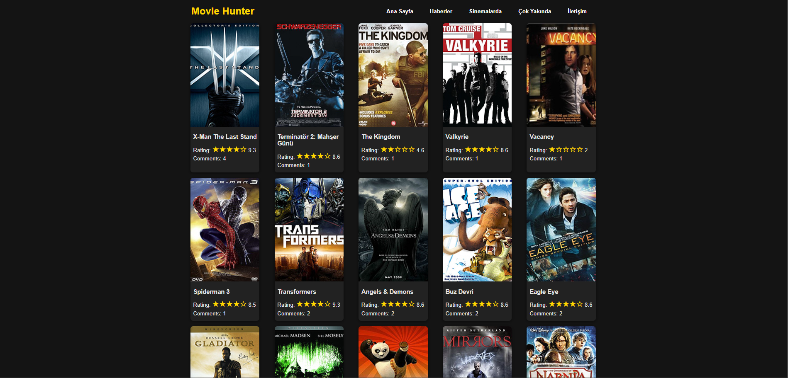
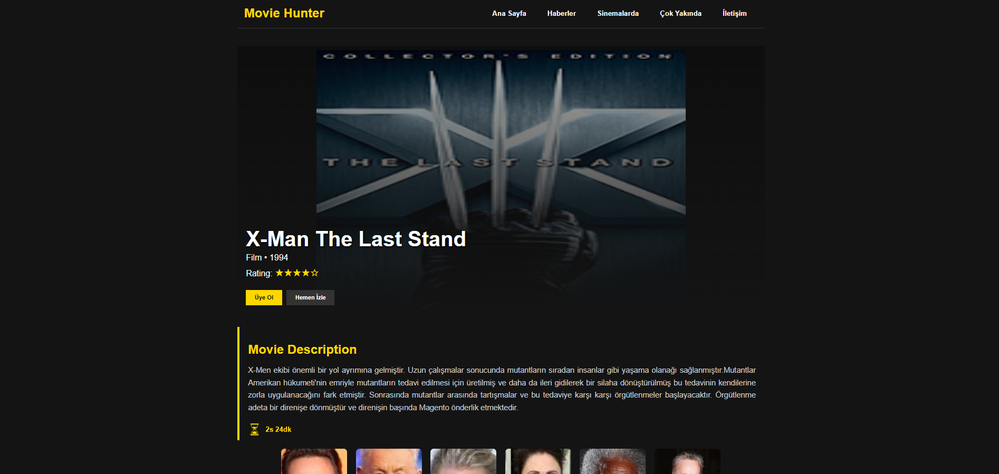
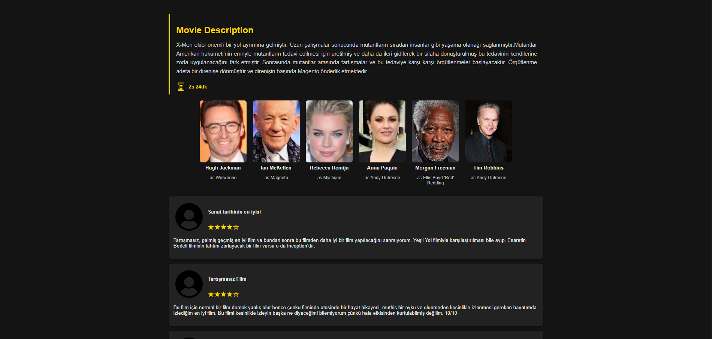
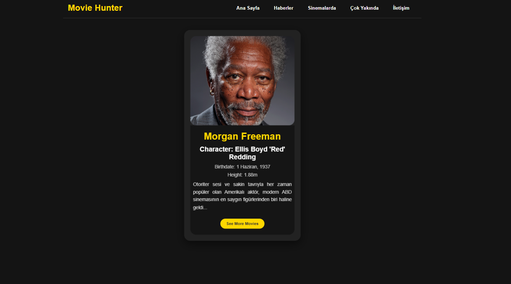

# Proje Açıklaması

Movie Explorer, Vue.js kullanılarak geliştirilmiş bir dinamik film keşif ve detaylandırma web uygulamasıdır. Bu proje, modern web teknolojileriyle film ve oyuncu bilgilerini kullanıcı dostu bir şekilde sunmayı amaçlamaktadır. Uygulama, JSON tabanlı veri kaynağından aldığı bilgilerle dinamik olarak film ve oyuncu detaylarını görüntüler ve kullanıcıların farklı bileşenler arasında sorunsuz bir şekilde gezinmesini sağlar.

---

# Proje Özellikleri

- **Dinamik Film ve Oyuncu Detayları:**
  - Filmleri ve oyuncuları dinamik olarak JSON dosyasından yükler.
  - Film detay sayfasında film açıklaması, puanı ve oyuncuları görüntüler.
  - Oyuncu detay sayfasında oyuncu biyografisi ve oynadığı filmler hakkında bilgi verir.

- **Vue Router ile Navigasyon:**
  - Sayfa yenilemeden farklı sayfalara geçiş sağlar.
  - Dinamik URL yapısı sayesinde belirli bir film veya oyuncuya kolay erişim imkânı sunar.

- **CSS ile Zengin Görsel Tasarım:**
  - Filmlerin arka plan resimleri dinamik olarak ayarlanır.
  - Responsive tasarım ile kullanıcı dostu bir arayüz sunar.

- **Yıldız Derecelendirme Sistemi:**
  - Film puanlarını yıldızlarla gösteren bir sistem kullanır.
  - `utils.js` dosyasındaki yeniden kullanılabilir fonksiyonlarla dinamik olarak hesaplanır.

---

# Kullanılan Teknolojiler

- **Vue.js:** Modern, reaktif bir kullanıcı arayüzü oluşturmak için kullanılan JavaScript framework'ü.
- **Vue Router:** Tek sayfa uygulamalarda (SPA) sayfa geçişlerini yönetmek için kullanılır.
- **CSS:** Web sitesinin görsel düzenini sağlar.
- **JSON:** Film ve oyuncu bilgilerini depolamak için kullanılır.
- **JavaScript (ES6):** Uygulamanın dinamik özelliklerini oluşturmak için kullanılır.
- **HTML:** Web uygulamasının temel yapısını oluşturur.

---

# Proje Yapısı

### 1. `index.html`
- Uygulamanın başlangıç dosyasıdır.
- Vue.js ve Vue Router bağlantılarını içerir.
- Navigasyon barı ve dinamik içerik için `<router-view>` bileşenini içerir.

### 2. `app.js`
- Vue Router yapılandırmasını içerir.
- `Home`, `MovieDetail` ve `ActorDetail` gibi bileşenleri bağlar.
- Vue uygulamasını başlatır ve `#app` ID'sine bağlar.

### 3. `Home.js`
- Ana sayfada film kartlarını dinamik olarak listeler.
- Filmlere tıklanıldığında detay sayfasına yönlendirir.

### 4. `MovieDetail.js`
- Filmlerin detay bilgilerini ve oyuncularını görüntüler.
- Film arka planını dinamik olarak film görseliyle doldurur.

### 5. `ActorDetail.js`
- Oyuncu detay bilgilerini (biyografi, oynadığı karakter) görüntüler.
- Home sayfasına yönlendiren bir buton içerir.

### 6. `utils.js`
- Tekrar eden işlemleri yöneten yardımcı fonksiyonları içerir (ör. yıldız derecelendirme hesaplama).

### 7. `style.css`
- Web sitesinin genel görünümünü ve tasarımını özelleştirir.

### 8. `movie.json`
- Tüm film ve oyuncu verilerini içeren veri kaynağıdır.

### 9. `images/`
- Film ve oyuncuların görsellerini depolar.

---

# Nasıl Çalıştırılır?

1. **Projeyi Klonlayın:**
   ```bash
   git clone https://github.com/username/movie-explorer.git
   cd movie-explorer
2. **Yerel Sunucu Başlatın:**
   ```bash
   npx serve .

3. **Tarayıcıda Açın:**
   ```bash
   http://localhost:5000

  ---
# Gelecekteki Geliştirmeler

- Gerçek bir API ile veri entegrasyonu sağlanabilir.
- Kullanıcı giriş/çıkış sistemi eklenebilir.
- Filtreleme ve arama özellikleri geliştirilebilir.
- Daha detaylı bir responsive tasarım uygulanabilir.

---
# Projenin Ekran Görüntüleri:
 <div>
  
  
  
  
</div>
